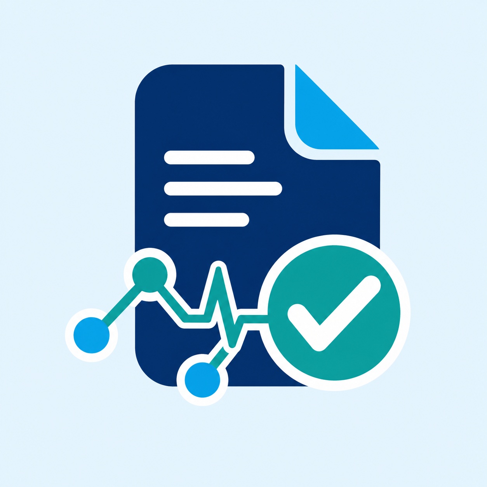
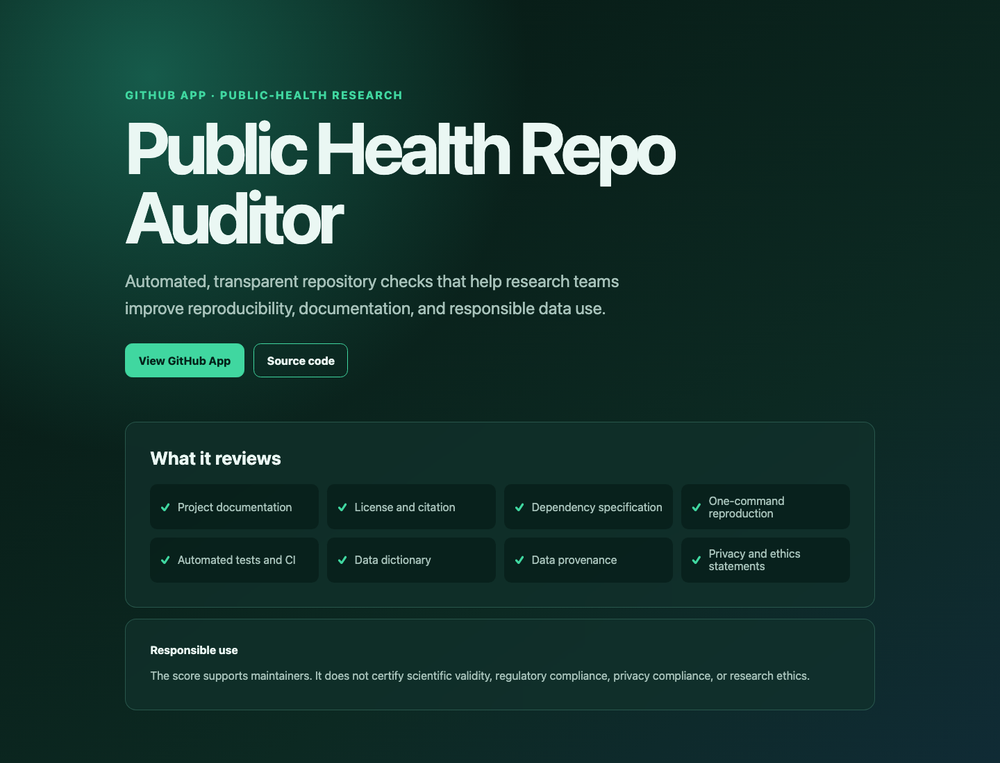

# Public Health Repository Quality Auditor

<p align="center">
  
</p>

[](https://github.com/khalilurrrahmanridoykhan/public-health-repository-quality-auditor/actions/workflows/ci.yml)
[](LICENSE)
[](https://www.python.org/)

A GitHub App and local CLI that reviews public-health research repositories for practical reproducibility, documentation, data governance, and software-quality signals.

[**View the registered GitHub App →**](https://github.com/apps/public-health-repo-auditor)



It checks for:

- Project documentation and data provenance
- Code and data licensing
- Machine-readable citation metadata
- Dependency and environment specifications
- One-command reproduction
- Automated tests or CI
- Data dictionaries or codebooks
- Privacy and sensitive-data warnings
- Ethics or IRB statements

The auditor produces a score, grade, evidence table, and actionable recommendations as a GitHub Check Run on every push.

The production webhook is implemented as a Next.js API route and deployed on
[Cloudflare Workers](https://public-health-repo-auditor.khalilur-ridoy.workers.dev).
The Python FastAPI service and CLI remain available for local or self-hosted use.

> [!IMPORTANT]
> This tool does not certify scientific validity, regulatory compliance, privacy compliance, or research ethics. It helps maintainers identify missing repository-quality signals.

## Try the local CLI

```bash
python3 -m venv .venv
source .venv/bin/activate
python -m pip install -e ".[dev]"
ph-repo-audit /path/to/research-repository
ph-repo-audit /path/to/research-repository --json
```

## Run the webhook service

Copy `.env.example` values into your deployment environment:

```bash
export GITHUB_APP_ID="123456"
export GITHUB_WEBHOOK_SECRET="replace-with-a-random-secret"
export GITHUB_PRIVATE_KEY="$(cat private-key.pem)"
uvicorn ph_repo_auditor.webhook:app --host 0.0.0.0 --port 8000
```

Health check: `GET /health`  
GitHub webhook endpoint: `POST /webhooks/github`

## Register the GitHub App

The app is registered as [Public Health Repo Auditor](https://github.com/apps/public-health-repo-auditor) with App ID `4402855`.

To finish activating it:

1. Deploy this service to a public HTTPS endpoint.
2. Set the app's webhook URL to the deployed `/webhooks/github` endpoint.
3. Set a strong webhook secret and store the same value in `GITHUB_WEBHOOK_SECRET`.
4. Confirm these repository permissions:
   - **Contents:** Read-only
   - **Checks:** Read and write
   - **Metadata:** Read-only
5. Subscribe to the **Push** event.
6. Generate a private key and configure it as `GITHUB_PRIVATE_KEY`.
7. Install the app on selected research repositories.

Use a secrets manager in production. Never commit the private key or webhook secret.

## Architecture

```text
GitHub push webhook
        │
        ▼
HMAC signature verification
        │
        ▼
GitHub App installation token
        │
        ▼
Repository tree + selected documentation
        │
        ▼
Rule-based quality audit
        │
        ▼
GitHub Check Run with score and recommendations
```

## Scoring

The initial rule set uses transparent, deterministic checks totaling 100 points. The score is designed for maintainers and should not be used to rank researchers or institutions. Future versions can support configurable policies for epidemiology, surveillance, modelling, and health-information-system projects.

## Development

```bash
python -m pip install -e ".[dev]"
pytest
```

To install dependencies, run every test, and build the production worker with
one command:

```bash
make reproduce
```

See [CONTRIBUTING.md](CONTRIBUTING.md) and [SECURITY.md](SECURITY.md).

## Support

For installation help, bug reports, or responsible-use questions, open a
[GitHub issue](https://github.com/khalilurrrahmanridoykhan/public-health-repository-quality-auditor/issues)
or email [khalilurrahmanridoykhan@gmail.com](mailto:khalilurrahmanridoykhan@gmail.com).
